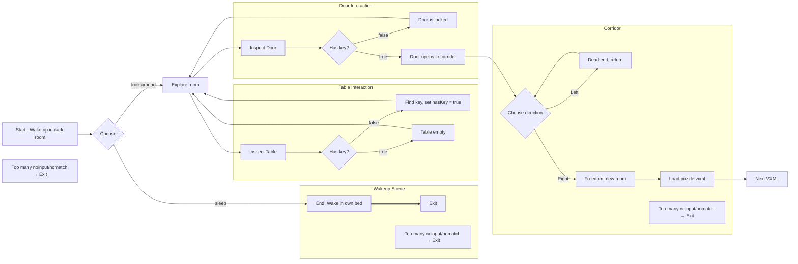
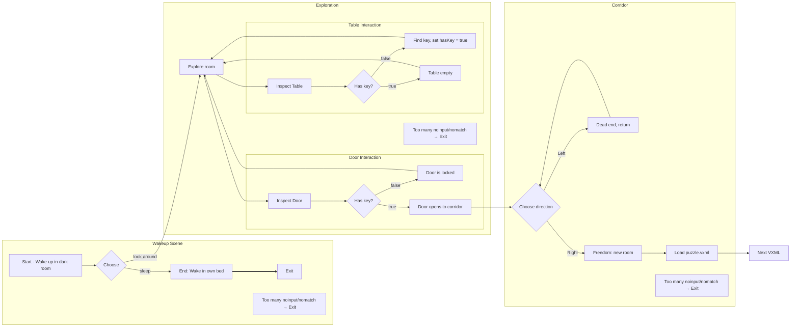
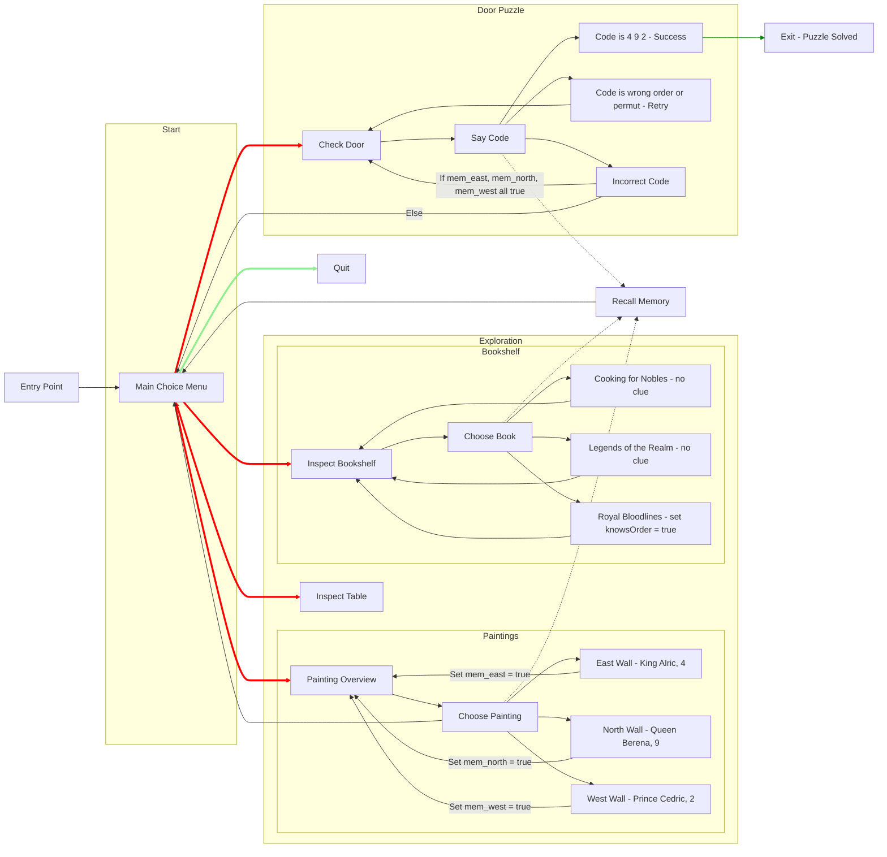

## dungeon.vxml

```mermaid
flowchart LR

    A[Start - Wake up in dark room]
    A --> B
    B{Choose}
    B -- sleep--> D
  subgraph wa1[Wakeup Scene]

    D[End: Wake in own bed]
    D ==> End1[Exit]
    V[Too many noinput/nomatch → Exit]
  end
    B --look around--> F
    End1 ~~~ P
    F[Explore room]
%%   subgraph re1[Room Exploration]
    %% G{Choose: door or table}
    W[Too many noinput/nomatch → Exit]

    I --> J{Has key?}
    H --> M{Has key?}
    %% G --> I
    %% G --> H
    F --> I
    F --> H
    
    subgraph Table Interaction
        I[Inspect Table]
        J -->|false| K[Find key, set hasKey = true]

        J -->|true| L[Table empty]
    end

  subgraph Door Interaction
    H[Inspect Door]
    M -->|false| N[Door is locked]

    M -->|true| O[Door opens to corridor]
    
  end
%%   end
    O --> P
    %% F --> G

    K --> F
    L --> F

    N --> F

  subgraph Corridor
    P{Choose direction}
    %% P --> Q[Left]
    %% Q --> R[Dead end, return]
    P --Left--> R[Dead end, return]
    R --> P

    %% P --> S[Right]
    %% S --> T[Freedom: new room]
    P --Right--> T[Freedom: new room]
    T --> U[Load puzzle.vxml]
    X[Too many noinput/nomatch → Exit]
  end


  U --> End2[Next VXML]

```

## dungeon.vxml (2nd option)

```mermaid
flowchart LR

  subgraph wa1[Wakeup Scene]
    A[Start - Wake up in dark room]
    A --> B
    B{Choose}

    D[End: Wake in own bed]
    D ==> End1[Exit]
    V[Too many noinput/nomatch → Exit]
  end
    B -- sleep--> D
    B --look around--> F
    End1 ~~~ P
    subgraph Exploration
    F[Explore room]
%%   subgraph re1[Room Exploration]
    %% G{Choose: door or table}
    W[Too many noinput/nomatch → Exit]

    I --> J{Has key?}
    H --> M{Has key?}
    %% G --> I
    %% G --> H
    F --> I
    F --> H
    
    subgraph Table Interaction
        I[Inspect Table]
        J -->|false| K[Find key, set hasKey = true]

        J -->|true| L[Table empty]
    end

  subgraph Door Interaction
    H[Inspect Door]
    M -->|false| N[Door is locked]

    M -->|true| O[Door opens to corridor]
    
  end
    end
%%   end
    O --> P
    %% F --> G

    K --> F
    L --> F

    N --> F

  subgraph Corridor
    P{Choose direction}
    %% P --> Q[Left]
    %% Q --> R[Dead end, return]
    P --Left--> R[Dead end, return]
    R --> P

    %% P --> S[Right]
    %% S --> T[Freedom: new room]
    P --Right--> T[Freedom: new room]
    T --> U[Load puzzle.vxml]
    X[Too many noinput/nomatch → Exit]
  end

    F~~~P
  U --> End2[Next VXML]

```

## puzzle.vxml

```mermaid

flowchart LR

  A[Entry Point]
  subgraph Start
    B[Main Choice Menu]
  end
    G[Recall Memory]
    G --> B
  A --> B

  subgraph Exploration
    B <==> C[Inspect Table]
    %% C --> B

    subgraph Paintings
    B ==> D[Painting Overview]
    D --> D1[Choose Painting]

    D1 --> D2[East Wall - King Alric, 4]
    D2 -->|Set mem_east = true| D

    D1 --> D3[North Wall - Queen Berena, 9]
    D3 -->|Set mem_north = true| D

    D1 --> D4[West Wall - Prince Cedric, 2]
    D4 -->|Set mem_west = true| D
    D1 --> B
    end

    subgraph Bookshelf
        B ==> E[Inspect Bookshelf]
        E --> E1[Choose Book]

        E1 --> E2[Cooking for Nobles - no clue]
        E2 --> E

        E1 --> E3[Legends of the Realm - no clue]
        E3 --> E

        E1 --> E4[Royal Bloodlines - set knowsOrder = true]
        E4 --> E

        %% E1 --> B
    end
	linkStyle 2 stroke:red
	linkStyle 3 stroke:red
	linkStyle 12 stroke:red
  end
    D1 -.-> G
    E1 -.-> G


  subgraph Door Puzzle
    B ==> F[Check Door]
    F --> F1[Say Code]

    F1 --> F2[Code is 4 9 2  - Success]

    F1 --> F3[Code is wrong order or permut - Retry]
    F3 --> F

    F1 --> F4[Incorrect Code]
    F4 -->|If mem_east, mem_north, mem_west all true| F
    F4 -->|Else| B
	linkStyle 22 stroke:red
  end
    F1 -.-> G
    F2 --> I[Exit - Puzzle Solved]
    B ==> H[Quit]
	linkStyle 32 stroke:lightgreen
	linkStyle 31 stroke:green


```